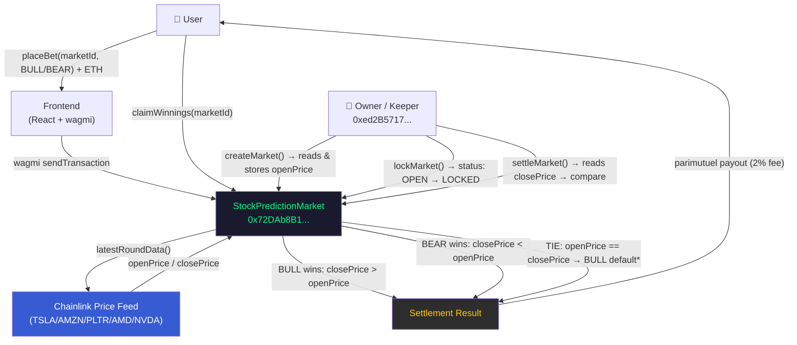

# Robinhood Stock Prediction Market


A parimutuel stock prediction market built on Robinhood Chain Mainnet, using native Stock Tokens (TSLA, AMZN, PLTR, AMD, NVDA) and live Chainlink Data Feeds as the price oracle.

**[Live Demo](https://frontend-tau-azure-50.vercel.app)** · Network: Robinhood Chain Mainnet (Chain ID 4663)

## Core Features

**Chain-Native Stock Token Integration**
Each market is anchored to a Robinhood Chain native stock token address. `createMarket()` accepts `address stockToken` directly, creating an on-chain verifiable link between the prediction market and the actual tokenized equity — something only possible on a chain purpose-built for RWA.

**Live Chainlink Data Feeds**
The contract reads real-time stock prices via Chainlink `AggregatorV3Interface`. Each stock has a dedicated `ChainlinkPriceFeed` wrapper deployed on Robinhood Chain Mainnet, connected to Chainlink's official price feed proxies live from day one of mainnet launch.

**Parimutuel Settlement**
No order book, no counterparty risk. BULL and BEAR pools accumulate independently. At settlement, the winning side splits the total pool proportional to their stake, minus a 2% protocol fee.

**Full Market Lifecycle**
`OPEN → LOCKED → SETTLED`. `lockMarket()` snapshots the opening price from the oracle. `settleMarket()` reads the closing price and determines the winning direction.

## Architecture



> *TIE 預設 BULL 贏為已知問題，W5 升級合約時修正為全額退款。

## Deployed Contracts

### Robinhood Chain Mainnet (Chain ID: 4663)

| Contract | Address |
|----------|---------|
| StockPredictionMarket | [0x72DAb8B1B53b3CF028e9A0d1E21178981f264245](https://robinhoodchain.blockscout.com/address/0x72DAb8B1B53b3CF028e9A0d1E21178981f264245) |
| TSLA ChainlinkPriceFeed | [0x072A3A0C04Cf8CDcaf5B4A73a4Ed4fF5A841531f](https://robinhoodchain.blockscout.com/address/0x072A3A0C04Cf8CDcaf5B4A73a4Ed4fF5A841531f) |
| AMZN ChainlinkPriceFeed | [0xcAC5B9d2817325E78090E3Ce4b9C299C819cF953](https://robinhoodchain.blockscout.com/address/0xcAC5B9d2817325E78090E3Ce4b9C299C819cF953) |
| PLTR ChainlinkPriceFeed | [0xBdC53E50b1167cE1199bFaD54A034f7ab1741051](https://robinhoodchain.blockscout.com/address/0xBdC53E50b1167cE1199bFaD54A034f7ab1741051) |
| AMD ChainlinkPriceFeed | [0x15636CE4C0EdE55335f84E6386f8F49C897c077d](https://robinhoodchain.blockscout.com/address/0x15636CE4C0EdE55335f84E6386f8F49C897c077d) |
| NVDA ChainlinkPriceFeed | [0x914c40a644493b47336de847b0404E729e06C68d](https://robinhoodchain.blockscout.com/address/0x914c40a644493b47336de847b0404E729e06C68d) |

### Chainlink Price Feed Proxies (Official, Robinhood Chain Mainnet)

| Ticker | Feed Address |
|--------|-------------|
| TSLA/USD | [0x4A1166a659A55625345e9515b32adECea5547C38](https://robinhoodchain.blockscout.com/address/0x4A1166a659A55625345e9515b32adECea5547C38) |
| AMZN/USD | [0xD5a1508ceD74c084eBf3cBe853e2C968fB2a651C](https://robinhoodchain.blockscout.com/address/0xD5a1508ceD74c084eBf3cBe853e2C968fB2a651C) |
| PLTR/USD | [0x820ABedFF239034956B7A9d2F0a331f9F075eB4c](https://robinhoodchain.blockscout.com/address/0x820ABedFF239034956B7A9d2F0a331f9F075eB4c) |
| AMD/USD | [0x943A29E7ae51A4798823ca9eEd2ed533B2A22C72](https://robinhoodchain.blockscout.com/address/0x943A29E7ae51A4798823ca9eEd2ed533B2A22C72) |
| NVDA/USD | [0x379EC4f7C378F34a1B47E4F3cbeBCbAC3E8E9F15](https://robinhoodchain.blockscout.com/address/0x379EC4f7C378F34a1B47E4F3cbeBCbAC3E8E9F15) |

### Robinhood Chain Stock Tokens (Official)

| Token | Address |
|-------|---------|
| TSLA | [0x322F0929c4625eD5bAd873c95208D54E1c003b2d](https://robinhoodchain.blockscout.com/address/0x322F0929c4625eD5bAd873c95208D54E1c003b2d) |
| AMZN | [0x12f190a9F9d7D37a250758b26824B97CE941bF54](https://robinhoodchain.blockscout.com/address/0x12f190a9F9d7D37a250758b26824B97CE941bF54) |
| PLTR | [0x894E1EC2D74FFE5AEF8Dc8A9e84686acCB964F2A](https://robinhoodchain.blockscout.com/address/0x894E1EC2D74FFE5AEF8Dc8A9e84686acCB964F2A) |
| AMD | [0x86923f96303D656E4aa86D9d42D1e57ad2023fdC](https://robinhoodchain.blockscout.com/address/0x86923f96303D656E4aa86D9d42D1e57ad2023fdC) |
| NVDA | [0xd0601CE157Db5bdC3162BbaC2a2C8aF5320D9EEC](https://robinhoodchain.blockscout.com/address/0xd0601CE157Db5bdC3162BbaC2a2C8aF5320D9EEC) |

### Robinhood Chain Testnet (Chain ID: 46630) — Legacy

| Contract | Address |
|----------|---------|
| StockPredictionMarket | [0x15636CE4C0EdE55335f84E6386f8F49C897c077d](https://explorer.testnet.chain.robinhood.com/address/0x15636CE4C0EdE55335f84E6386f8F49C897c077d) |

## Quick Start

### Prerequisites
- Node.js 18+
- A funded wallet on Robinhood Chain Mainnet

```bash
# 1. Install dependencies
npm install

# 2. Configure environment
cp .env.example .env
```

| Variable | Description |
|----------|-------------|
| `PRIVATE_KEY` | Deployer wallet private key (no 0x prefix) |

```bash
# 3. Compile
npx hardhat compile

# 4. Deploy to mainnet
npx hardhat run scripts/deploy.js --network robinhoodMainnet
```

## Contract Interface

```solidity
// Create a new prediction round
createMarket(address stockToken, address priceFeed, string symbol, uint256 duration) returns (uint256 marketId)

// Place a bet (send ETH as value)
placeBet(uint256 marketId, Direction direction)  // Direction: 0 = BULL, 1 = BEAR

// Lock market and snapshot opening price
lockMarket(uint256 marketId)

// Settle market and determine winner
settleMarket(uint256 marketId)

// Claim winnings after settlement
claimWinnings(uint256 marketId)
```

## Fees & Security

**Fees**
- Protocol fee: 2% of total pool at settlement
- No winner scenario: all bets refunded in full

**Security**
- One bet per address per market
- Minimum bet enforced (0.001 ETH)
- Owner-only market lifecycle controls (createMarket, lockMarket, settleMarket)
- No reentrancy risk: claimed flag set before transfer
- Chainlink staleness check: 3-day threshold (covers weekends and market holidays)

## Implementation Notes

**Live Chainlink Integration**
Robinhood Chain launched mainnet on July 1, 2026 with Chainlink as the official oracle layer from block zero. This contract integrates Chainlink Data Feeds via a `ChainlinkPriceFeed` wrapper that implements `IPriceFeed` (mirrors `AggregatorV3Interface`). Replacing or upgrading feeds requires only a constructor argument change — zero contract modifications.

**Stock Token as Market Identifier**
On most chains, a prediction market would use an arbitrary string or uint to identify a market. On Robinhood Chain, we use the native stock token contract address directly, creating an on-chain verifiable link between the prediction market and the actual tokenized equity.

## Stack

| Layer | Technology |
|-------|-----------|
| Smart contract | Solidity ^0.8.20 |
| Development | Hardhat 3 + ethers.js |
| Oracle | Chainlink Data Feeds (AggregatorV3Interface) |
| Stock tokens | Robinhood Chain native (TSLA, AMZN, PLTR, AMD, NVDA) |
| Frontend | React + wagmi v2 + Vite |
| Deployment | Vercel |

## Roadmap

✅ **M1 — Contract Deployment**
- StockPredictionMarket deployed on Robinhood Chain Testnet
- Parimutuel logic with BULL/BEAR markets
- MockPriceFeed (Chainlink-compatible) per stock token

✅ **M2 — Frontend**
- React + wagmi frontend
- Live market odds display, bet placement, claim UI
- Deployed to Vercel

✅ **M3 — Mainnet**
- Deployed to Robinhood Chain Mainnet (Chain ID 4663) on July 3, 2026
- Replaced MockPriceFeed with live Chainlink Data Feeds
- TSLA / AMZN / PLTR / AMD / NVDA markets live

⬜ **W3 — Keeper Automation**
- VPS-based keeper for automatic lockMarket / settleMarket
- Scheduled via cron on Hetzner VPS

⬜ **W4 — Architecture Diagram**

⬜ **W5 — NatSpec Documentation**

## Developer

GitHub: [pplmaverick](https://github.com/pplmaverick)
Wallet: `0xed2B5717c9b936ecC76d75401026A99143e278F5`

## License

MIT
